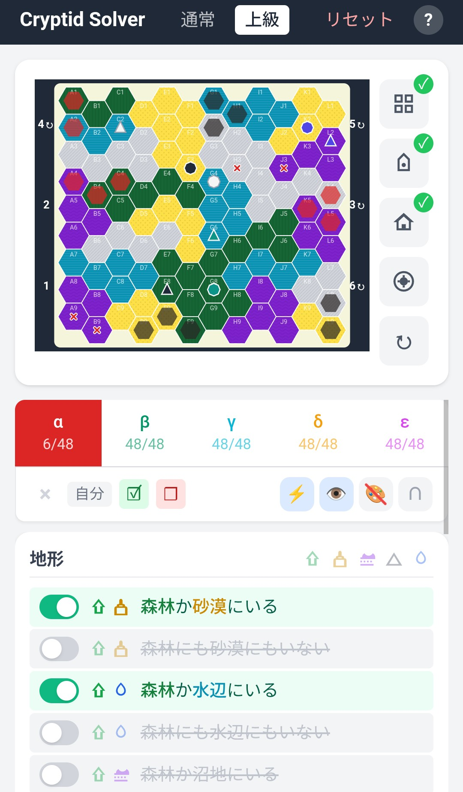

# 🔍 Cryptid Logic Solver

ボードゲーム「クリプティッド」のヒント推論補助ツール

[](https://kuronekorou39.github.io/cryptid-logic-solver/)
[](LICENSE)
[](https://kuronekorou39.github.io/cryptid-logic-solver/)

<p align="center">
  
</p>

---

## ✨ 機能

- **マップ設定** - タイル配置・巨石・廃墟の位置を設定
- **マーカー配置** - disc / cube をマップ上に配置
- **自動計算** - マーカーに基づいてヒントを自動絞り込み
- **解の候補探索** - 答えが1マスになるパターンを自動探索
- **ヒント確定** - 確定したヒントを他プレイヤーから自動除外
- **PWA対応** - オフライン動作・ホーム画面に追加可能

---

## 🎮 使い方

```
1️⃣ マップを設定     →  タイル・巨石・廃墟の位置を入力
2️⃣ プレイヤーを有効化  →  α〜εタブをタップ
3️⃣ マーカーを配置    →  マップ上で○/×を配置
4️⃣ ヒントを確認     →  自動で絞り込まれた候補を確認
```

> 💡 **ヒント**: 右上の `?` ボタンで詳しい使い方を確認できます

---

## 🛠️ 技術スタック

React 18 / TypeScript / Vite / Tailwind CSS / PWA

---

## 💻 開発

```bash
npm install    # 依存関係のインストール
npm run dev    # 開発サーバー起動
npm run build  # 本番ビルド
```

---

## 📄 ライセンス

MIT

---

<p align="center">
  <a href="https://kuronekorou39.github.io/cryptid-logic-solver/">
    <strong>🎯 今すぐ使う →</strong>
  </a>
</p>
